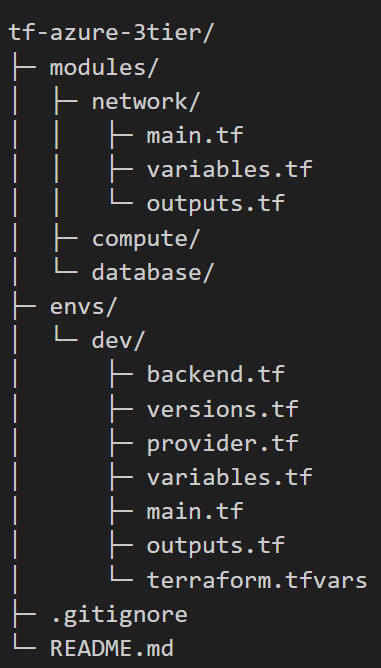
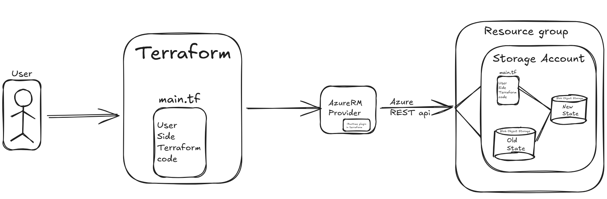

# terraform

Description : 
This is a small passion project to explore the tool : Terraform
The goal of this project is to use the 3-tier architure and alloate resources in each tier : 
1. Network
2. Database
3. Compute

Each resource allocates multiple cloud resources through terraform scripts, some of them are : 
azurerm_virtual_network
azurerm_subnet (public)
azurerm_subnet (private)
azurerm_network_security_group (public)
azurerm_network_security_group (private)
azurerm_subnet_network_security_group_association (public)
azurerm_subnet_network_security_group_association (private)
azurerm_public_ip (nat_gateway_ip)
azurerm_nat_gateway
azurerm_nat_gateway_public_ip_association
azurerm_subnet_nat_gateway_association
azurerm_linux_virtual_machine_scale_set
azurerm_network_interface (within VMSS)
azurerm_public_ip (for compute/LB)
azurerm_lb
azurerm_lb_backend_address_pool
azurerm_lb_probe
azurerm_lb_rule
azurerm_postgresql_flexible_server
azurerm_postgresql_flexible_server_firewall_rule

if it wasnt obvious, yes im using azure as the cloud platoform for this project! 
I have made notes for myself to refer later, this is purely a self journal of this half a day project, 
read it at your own risk...

--- 
Folder structure : 

---

Initializing the terraform backend : 

- terraforms azurerm uses azure credentials to call the azure rest api, now terraform can access my azure acount 
- first i created an azure resource group named rg-tfstate because in order to hold the stoarge account, i need a rg 
- now within the resource group, i made initialized a blob storage so i can host the storage account to the blob 
- once i got the key and created the blob container, i created the backend.tf file with all the configuration details (writen in hashcorp configuration language)
- SO basically what ive done so far is to give terraform the exact idea of : 
    which resource group to check , storage account name, container name and key name
- Now i executed the command "terraform init". With the execution of this command, the backend.tf script gets executed and creates the remote state location 
- The reason i am using a remoate state to store the state of my tf is so that there can be ease of collaboration in teams 

azureRM provider : 
    - This is a tool that talks to the azure REST api to allocate resources 

azurerm backend : 
    - The mechanism that manages how the terrform state file is stored and updated in azure blob storage. 

State file : 
    - The file that consists of the current state of the infrastructure. This file is stored as an object in the blob storage. Extension is .tfstate file. 

- All the other team memebers will pull the latest state from the blob storage and make changes to maintain collaboration and versioning. 

---

Network module : 

- consists of three types of files : 
    - main - 
        - Contains all the resource allocation with resource keyword
        - vnet, subnet, nat gateway, etc
    - variable : 
        - Contains all the variables that are defined with variable and type keywords.  
         
    - output : 
        - used with the output and the value keyword
        - When terraform apply is given, the output results in the value defined

- Backend.tf : 
    - configures the state file in the blob storage / azure storage 
    - resource group name, storage account name, container name, etc are defined here 
    - state is stored remotely in azure cloud containers, collaborators can work together by using locking and versioning features

- version.tf : 
    - this gives us details about the terraforms version and the azureRM providers versions

- provider.tf : 
    - this file consists of the login crednetials that uniquely identifies your azure cloud account
    - this is used by the azureRM provider to connect to the azure REST api

- network/main.tf :    
    - this file calls the network module that was created earlier
    - the keyword module is used 

- terraform.tfvars: 
    - a secret gitignored file which consists of all the secret variables 

Terraform commands used : 
| Command                         | Purpose                                                                              |
| ------------------------------- | ------------------------------------------------------------------------------------ |
| `terraform init`                | Installs provider plugins, configures backend, prepares working directory.           |
| `terraform validate`            | Performs static syntax and semantic checks on your HCL configuration.                |
| `terraform plan`                | Builds and shows an execution plan (what Terraform will do).                         |
| `terraform apply`               | Applies the changes required to reach the desired state of the configuration.        |
| `terraform apply -auto-approve` | Skips the interactive approval prompt.                                               |
| `terraform plan -out=tfplan`    | Saves the plan to a file so you can guarantee the apply uses exactly that plan.      |
| `terraform apply tfplan`        | Applies a previously saved plan.                                                     |
| `terraform providers`           | Lists which provider versions Terraform will use (and which are actually installed). |
| `terraform version`             | Shows Terraform core version and installed providers.                                |

---
